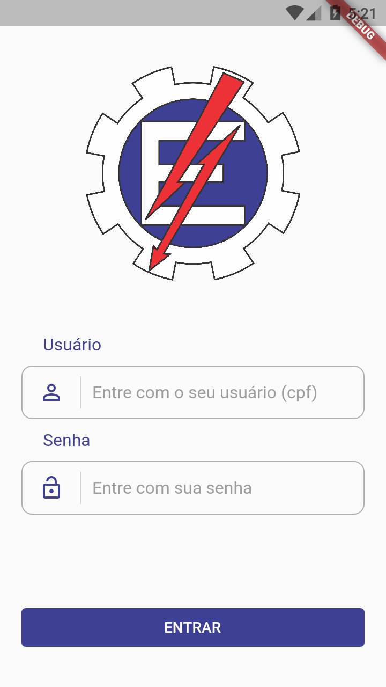
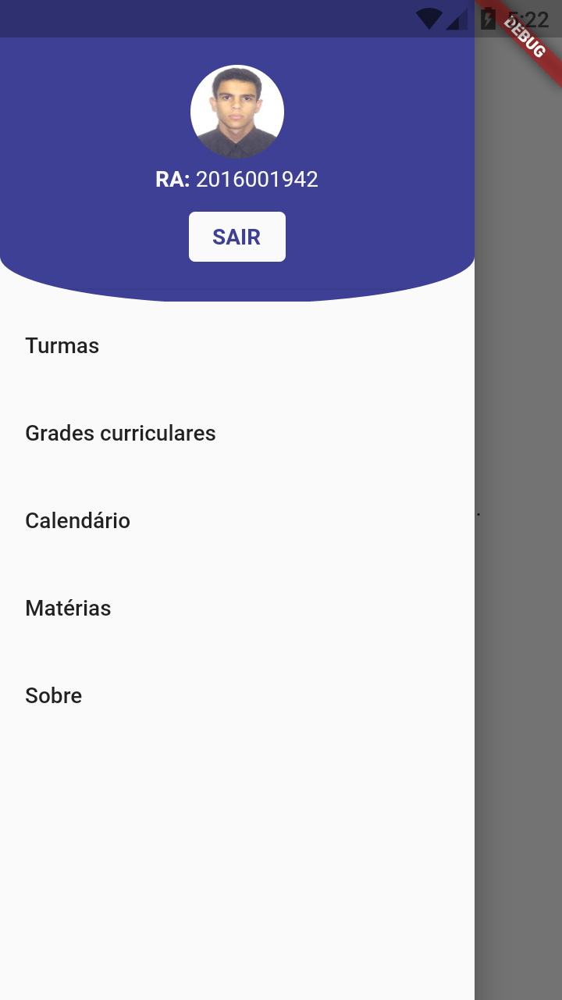
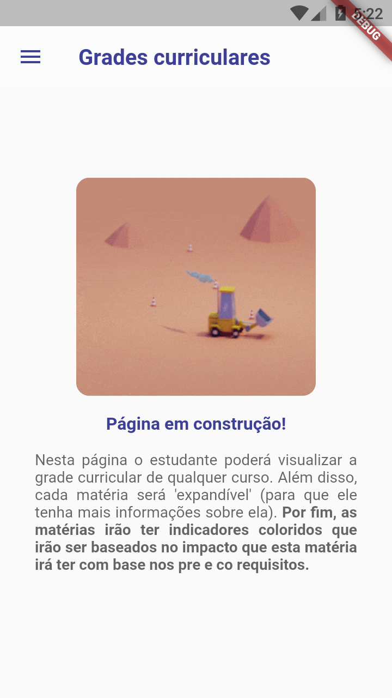
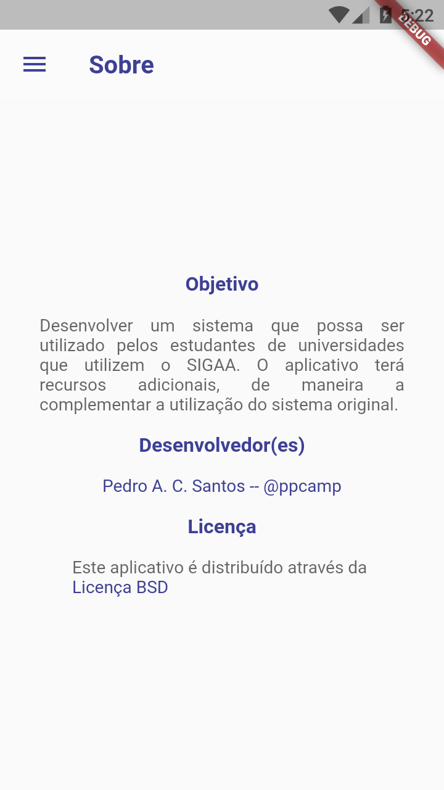

# Sigaa student's helper

> Este projeto trata-se de um scrapper que rodará no client (não havendo nenhuma posse dos dados do usuário).

> O intuito deste projeto é dar mais facilidade ao acesso do sistema pelos usuários, além disso, este projeto irá servir como um complemento às ferramentas já existentes.

> Neste projeto serão desenvolvidas várias ferramentas mas a principal será um analisador de grafos que irá avaliar a "importância" que uma matéria tem com base apenas nos pré e co requisitos.

---

## Screenshots

  

  

  

  

  

